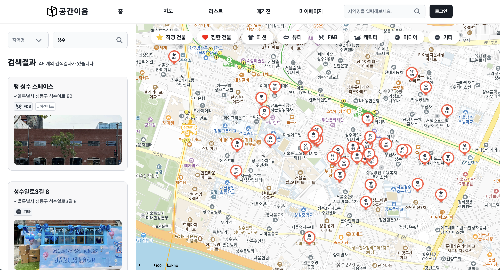
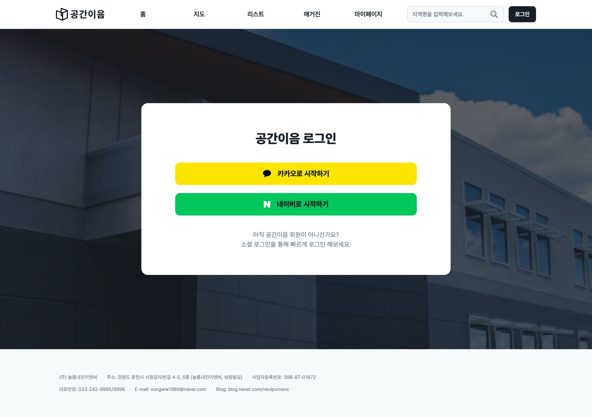
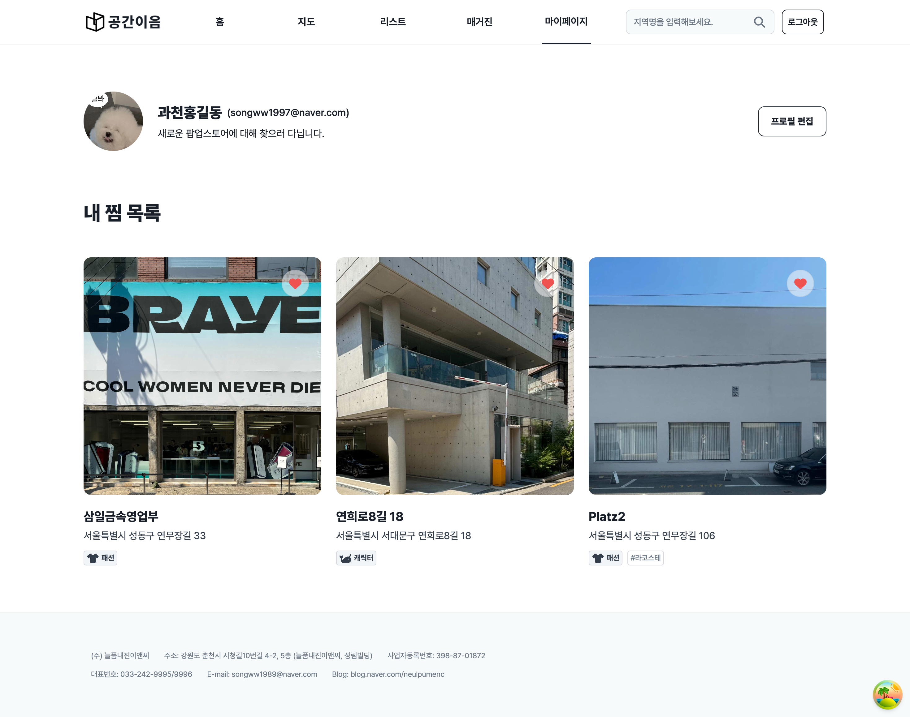
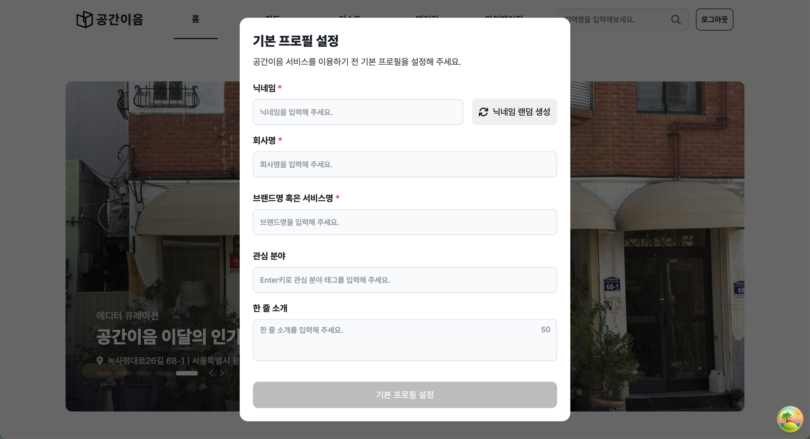
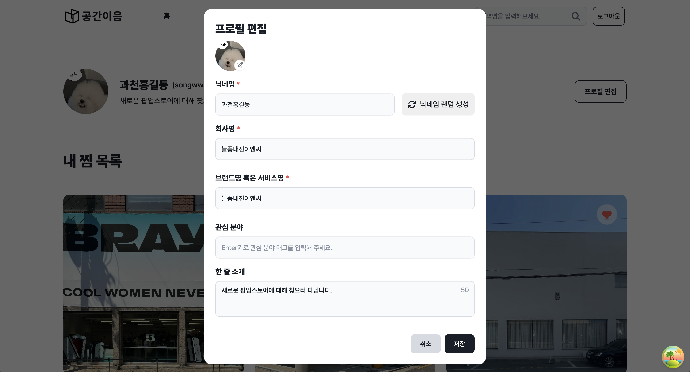
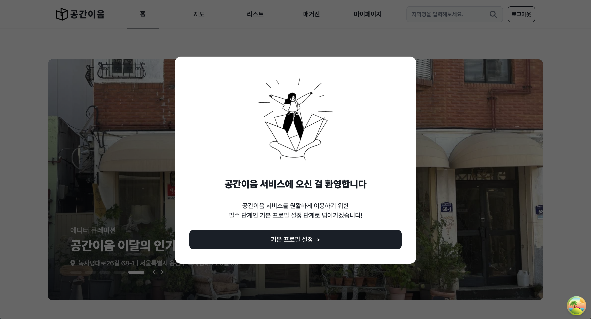
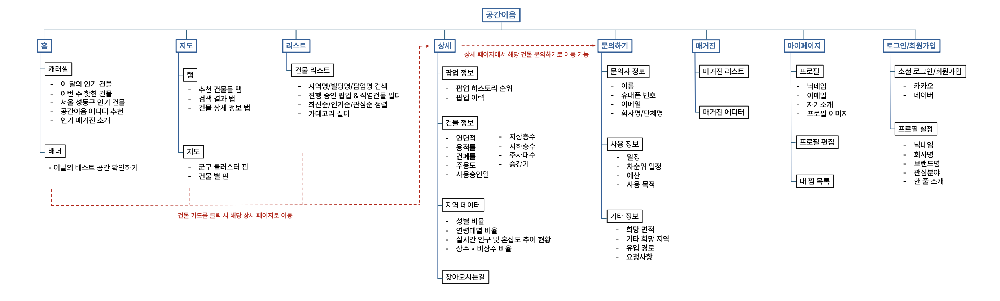

# 🏢 공간이음 \_ 공간과 사람을 잇다

### 📌 늘품ENC - 공간이음 프로젝트

- "공간이음"이란 팝업스토어을 운영할 수 있는 공간을 매개체로 공간과 사람을 물리적으로, 사회적으로 이어준다는 비전을 담은 이름입니다.<br></br>

> 배포 링크: [공간이음 웹사이트 바로가기](https://www.gongganieum.com)

> 개발 기간: 2024. 05. 22 ~

<br></br>

## 💁🏻‍♀️ 프로젝트 소개

- 공간이음은 팝업스토어를 운영할 수 있는 건물 중에 각자 상황에 맞는 건물을 찾을 수 있는 웹 기반 플랫폼입니다.
- 공간이음에서 추천하는 건물과 직접 운영하는 직영건물을 찾아볼 수 있습니다.
- 매거진을 통해 트렌디한 팝업 스토어 건물에 대한 소개를 살펴볼 수 있습니다.

## 🛠️ 기술스택

**Frontend**

- React (v18)
- TypeScript
- Next.js (Page router)
- tailwind css
- zustand
- axios
- react-query
- react-hook-form

**Backend**

- Node.js (v10.5.2)
- Express
- AWS
  - EC2
  - S3
- RDS(MySQL, MariaDB)

## 🔎 Quick start guide

```jsx
$ git clone https://github.com/Neul-pum/Gongganieum_FE.git
$ npm install
$ npm run dev
```

## 🎉 최근 업데이트 내역 (관리자페이지 구현)
> 🔻 관리자 페이지 플로우 영상 (데이터 정보 조회/수정, 수정사항 사이트 실시간 반영) (Youtube Link)

[](https://youtu.be/KsyVP3jeiKo)


## 📄 페이지별 스크린샷

<details>
  <summary><b>홈페이지</b></summary>
  <div markdown="1">
    
  </div>
</details>
<br/>
<details>
  <summary><b>지도 페이지</b></summary>
  <div markdown="1">
    
  </div>
</details>
<br/>
<details>
  <summary><b>리스트 페이지</b></summary>
  <div markdown="1">
    
  </div>
</details>
<br/>
<details>
  <summary><b>상세 페이지</b></summary>
  <div markdown="1">
    
  </div>
</details>
<br/>
<details>
  <summary><b>로그인 페이지</b></summary>
  <div markdown="1">
    
  </div>
</details>
<br/>
<details>
  <summary><b>마이 페이지</b></summary>
  <div markdown="1">
    
  </div>
</details>
<br/>
<details>
  <summary><b>모달</b></summary>
  <div markdown="1">
    
  </div>
  <div markdown="1">
    
  </div>
  <div markdown="1">
    
  </div>
</details>
<br>

## 🗂️ IA (Information Architecture)



###### 팀원: 임건우 (FE), 송민혁 (FE), 김기연 (BE, FE) (~ 24.08.05)
